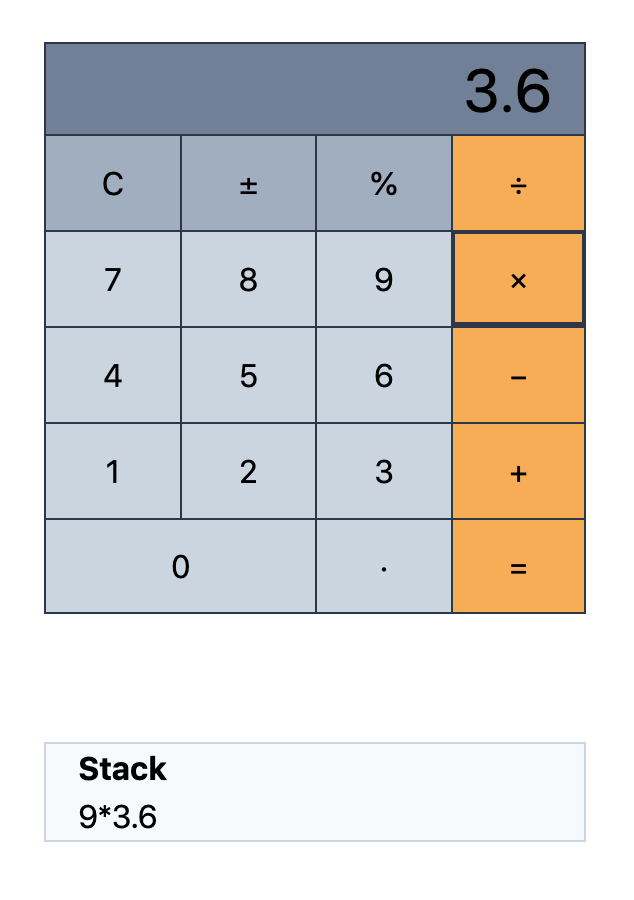

## Livewire Calculator

This is a Laravel Livewire calculator component that mimics the basic Apple OS calculator. It uses [Laravel PHP](https://laravel.com) with [Blade templates](https://laravel.com/docs/master/blade), [Laravel Livewire](https://laravel-livewire.com), [Tailwind CSS](https://tailwindcss.com), and NO custom JavaScript.

### Preview:

### Things to try:
- Calculate with equals: `2+3=`
- Calculate with operator: `2+3+4+5+`
- Calculate with number and operator: `3*=`
- Start another calculation: `2+3= 4+5=`
- Percent: `2%`
- Negate: 2&plusmn;
- Decimals and negatives: `-2.4`
- Change operator without calculating: `2+-*/4=`
- `2+3%` disregards first number
- `2+3!` negates last number
- Prepend 0 on decimal: `0.`
- Block multiple decimals
- Block first inputs as operators
- Show error for large numbers
- Round large decimals
- Divide by zero fallsback to zero: `2/0=`

### Nice to haves:
- Code refactor and clean-up
- Support keydown actions for all calculator buttons
- Show error message on divide by zero
- Pressing equals multiple times applies last operation
